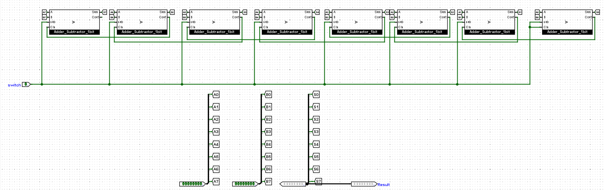
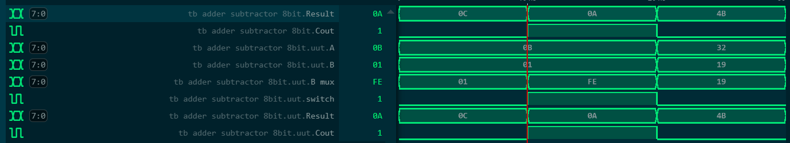

# 8-Bit Ripple Carry Adder-Subtractor

Gate-level design and RTL implementation of an 8-bit Adder-Subtractor in Verilog. This project focuses on resource sharing by utilizing 2's complement arithmetic to merge addition and subtraction into a single data path.

## 1. Hardware Architecture

Instead of instantiating separate adder and subtractor blocks along with an output multiplexer, the design optimizes logic gates using XOR operators.

*   **Mode Control (`switch`):**
    *   `0`: Addition Mode (Sum = A + B + 0)
    *   `1`: Subtraction Mode (Sum = A + ~B + 1 = A - B)
*   **Implementation:** The input `B` is XORed with the `switch` signal. In subtraction mode (`switch = 1`), the XOR gate acts as an inverter for `B`, and the `switch` signal is fed into the `Cin` of the first Full Adder to complete the `+1` requirement for 2's complement.

### Gate-level Schematic

## 2. RTL Verilog Design

` ` `verilog
module adder_subtractor_8bit (
    input  [7:0] A,
    input  [7:0] B,
    input        switch,
    output [7:0] Result,
    output       Cout
);
    wire [7:0] B_mux;
    
    // Invert B if switch == 1 (Subtraction)
    assign B_mux = B ^ {8{switch}}; 
    
    // Core arithmetic
    assign {Cout, Result} = A + B_mux + switch;
endmodule
` ` `

## 3. Simulation & Verification

The logic was verified using an automated testbench (`tb_adder_subtractor_8bit.v`) covering:
*   Standard 8-bit addition.
*   8-bit subtraction (verifying 2's complement wrapping).
*   Carry-out (Overflow) validation.

### Waveform Analysis

**Toolchain:**
*   Simulator: Icarus Verilog
*   Waveform Viewer: WaveTrace / GTKWave

### Quick Start / Run Simulation

` ` `bash
# 1. Compile the design
iverilog -g2012 -s tb_adder_subtractor_8bit -o build/sim_out.out adder_subtractor_8bit.v tb_adder_subtractor_8bit.v

# 2. Run simulation
vvp build/sim_out.out
` ` `

---
**Author:** Nguyen Huu Viet Dung
